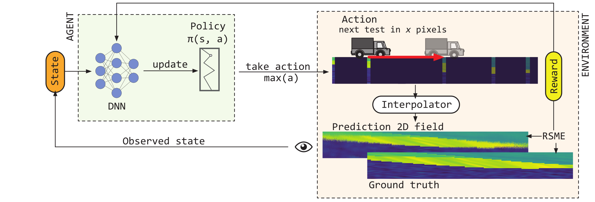

# CPTSuperLearn

## Objective

CPTSuperLearn is a Deep Reinforcement Learning framework designed to improve subsurface in-situ testing.
The objective of this project is to train and evaluate a Deep Q-Learning (DQL) agent to optimize the placement
of in-situ testing (e.g. Cone Penetration Test) points in a given environment.
The agent learns to minimize the Root Mean Square Error (RMSE) between the true and predicted data
while considering the cost of sampling.




## Installation

### Pre-requisites

- Python 3.11
- The data files for training and validation are available on [Zenodo](https://zenodo.org/records/13143431/files/data.zip).
- If you want to use the data from the schemaGAN, you need to download the [schemaGAN model](https://zenodo.org/records/13143431/files/schemaGAN.h5).
- To automatically download the data files and the schemaGAN model, run the following script:
    ```sh
    python download_data.py
    ```

### Install the package
To install the package we recommend the use of a [Python virtual environment](https://docs.python.org/3/library/venv.html).
The virtual environment should be installed and activated before the installation of CPTSuperLearn.

To install the package, you can use either of the following methods:

#### Using pip
You can install the package directly using pip:

```sh
pip install git+https://github.com/brunozc/cpt_super_learn
```

#### Cloning the repository

You can also install the package by cloning the repository:
```sh
git clone https://github.com/brunozc/CPTSuperLearn.git
cd CPTSuperLearn
```

After cloning the repository, you can install the package using pip:
```sh
pip install .
```

or alternatively by installing the requirements file:
```sh
pip install -r requirements.txt
```


## Usage

### Configuring file
CPTSuperLearn uses a configuration file to set the parameters for the DQL agent.
This allows you to customize the training and evaluation process, and allows for a clear
reproducible setup.
The configuration file is in YAML format and has the following structure.

```yaml
# CPTSuperLearn Configuration

# General settings
seed: 14
data:
  train_folder: "data/train"
  validation_folder: "data/vali"

# Environment settings
environment:
  actions: [25, 50, 100, 150]  # Action values in pixels
  max_nb_cpts: 20             # Maximum number of CPTs
  weight_reward_cpt: 0.6      # Weight for CPT cost in reward function
  image_width: 512            # Width of the environment image
  max_first_step: 1           # Maximum number of pixels for the the first step
  interpolation_method: "SchemaGAN"  # Options: "SchemaGAN", "InverseDistance"
  interpolation_method_params: "schemaGAN/schemaGAN.h5"  # if SchemGAN (path to model) if InverseDistance (number of neighbors)

# Agent settings
agent:
  state_size: 6               # Size of the state space
  learning_rate: 0.0001       # Learning rate for optimizer
  gamma: 0.99                 # Discount factor
  epsilon_start: 0.95         # Starting exploration rate
  epsilon_end: 0.05           # Final exploration rate
  epsilon_decay: 0.99996      # Decay rate for epsilon
  memory_size: 10000          # Size of replay memory
  batch_size: 64              # Batch size for training
  nb_steps_update: 100        # Steps between target network updates
  hidden_layers: [32, 64, 64, 32]  # Neural network architecture
  use_batch_norm: true        # Use batch normalization
  activation: "relu"          # Activation function

# Training settings
training:
  nb_episodes: 100000         # Number of training episodes
  make_plots: false           # Generate plots during training
  output_folder: "results"    # Folder to save results
  log_interval: 10            # Episode interval for logging

# Validation settings
validation:
  make_plots: false           # Generate plots during validation
  output_folder: "results/validation"  # Folder to save validation results
```


### Training the Model

To train the DQL agent, run the [`train_model`](train_model.py) script:

```sh
python train_model.py --config config.yaml
```

This will train the model using the configuration file config.yaml.

### Evaluating the Model

To evaluate the trained model, run the [`validate_model`](validate_model.py) script:

```sh
python validate_model.py --config config.yaml
```

This will evaluate the model using the configuration file config.yaml.


### Plotting Results
To visualize the validation results, run the [`plot_validation`](plot_validation.py) script:

```sh
python plot_validation.py
```

### Project Structure

```plaintext
CPTSuperLearn
├── CPTSuperLearn
│   ├── __init__.py
│   ├── agent.py
│   ├── environment.py
│   ├── interpolator.py
│   ├── metric.py
│   ├── runner.py
│   └── utils.py
├── game
│   ├── __init__.py
│   └── cpt_game.py
├── train_model.py
├── validate_model.py
├── plot_validation.py
├── run_game.py
├── download_data.py
└── setup.cfg
```

* CPTSuperLearn: Contains the core modules for the environment, agent, interpolators, metrics, runner and utilities.
* game: Contains the implementation of the CPT game environment.
* train_model.py: Script to train the DQL agent.
* validate_model.py: Script to evaluate the trained model.
* plot_validation.py: Script to plot the validation results.
* run_game.py: Script to run the CPT game.
* download_data.py: Script to download the data files and schemaGAN model.


## Citation
To cite this work, please use the following reference:

```bibtex
@article{DRL_2025,
  author={Zuada Coelho, B. and Smyrniou, E. and Campos Montero, F.A.},
  title={Optimizing geotechnical in-situ site investigations using Deep Reinforcement Learning},
  ISSN={3050483X},
  DOI={10.1016/j.geoai.2025.100038},
  journal={Geodata and AI},
  year={2025},
  pages={100038}
}
```

## License
This project is licensed under the MIT License. See the [LICENSE](LICENSE) file for details.

